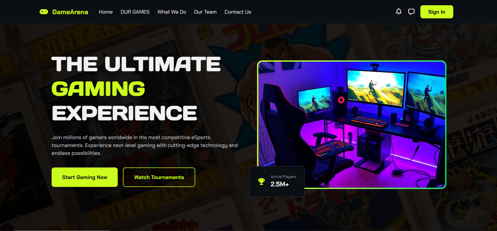

# 🎮 GameArena

### A Modern Esports & Gaming Platform UI

  A sleek and immersive gaming website interface showcasing esports tournaments, featured games, team members, and community engagement in a bold modern style.

  <a href="https://game-arena-theta.vercel.app/"><strong>🔴 Live Demo</strong></a>

---

## 📸 Preview

---

## ✨ Highlights

- 🎯 Modern and immersive gaming-inspired UI
- 📱 Fully responsive layout
- 🕹️ Hero section with strong visual impact
- 🎮 Featured games showcase section
- 🚀 Services / What We Do section
- 👥 Team members presentation
- 📬 Contact section with community-focused design
- 🌈 Smooth hover effects and interactive components

---

## 🛠️ Tech Stack

- **HTML5**
- **CSS3**
- **Bootstrap**
- **Font Awesome**

---

## 🌍 Live Demo

👉 [View Website](https://game-arena-theta.vercel.app/)

---

## 📋 About The Project

**GameArena** is a front-end gaming website concept designed to deliver a visually engaging esports experience.  
The project focuses on combining strong visuals, responsive structure, and interactive UI sections to create a modern platform for showcasing games, tournaments, professional players, and gaming communities.

---

## 📌 Main Sections

- **Home / Hero Section**
- **Our Games**
- **What We Do**
- **Our Team**
- **Contact Us**

---

## 🎨 Design Style

This project uses a bold visual identity inspired by gaming and esports platforms, featuring:

- Dark themed interface
- Vibrant accent colors
- Modern typography
- Interactive cards and buttons
- Clean section spacing and layout balance

---

## 🚀 Future Improvements

- Add JavaScript interactivity for dynamic sections
- Connect the contact form to a backend service
- Add real tournament data and gaming news
- Improve accessibility and performance optimization
- Add animations for smoother user engagement

---

## 👩‍💻 Author

**Nada Mahrous**

- GitHub: [@nada-mahrous](https://github.com/nada-mahrous)

---

### ⭐ If you like this project, don’t forget to star the repo!

